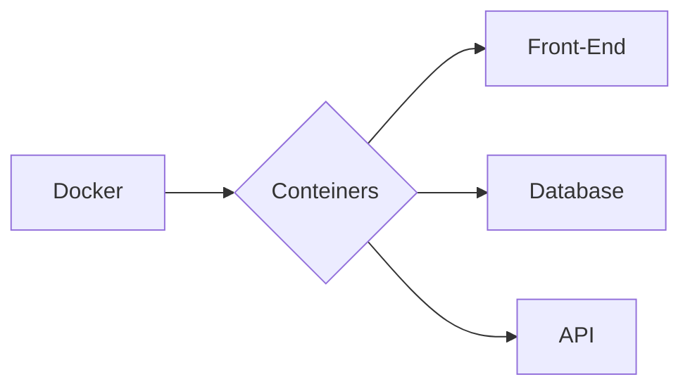

# Sobre o Projeto:
Estudos utilizando o Docker + PHP

- Nginx
- Docker Compose


### COMANDOS DOCKER FILE

```
1º - 
2º - 
3º -
```

### COMANDOS DOCKER COMPOSE

```
1º - Iniciar docker: docker-compose up
2º - Url: http://app.localhost/
3º -
```


### FLUXOGRAMA/DIAGRAMA



### FONTE:
Ambiente de desenvolvimento Docker - Github: (url: https://github.com/marcossaore/ambiente-dev-docker)
Ambiente de desenvolvimento Docker - Medium: (url: https://medium.com/4yousee/infraestrutura-em-ambiente-de-desenvolvimento-com-docker-parte-1-eb28507d5eca)


### 1.0 - CICLO DE VIDA

<ul>
  
  <li>
    <p><b><code>1.1 - [] </code></b></p>
    <p><i> Instrução:  </i></p>
  </li>
  
  <li>
    <p><b><code>1.2 - [] </code></b></p>
    <p><i> Fase-1:  </i></p>
  </li> 
  
  <li>
    <p><b><code>1.3 - [] </code></b></p>
    <p><i>  </i></p>
  </li>
  
</ul>

