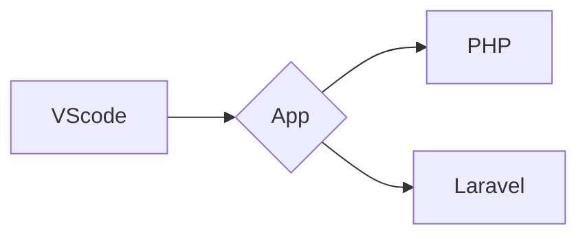

# Sobre o Projeto:
Estudos utilizando o PHP + LARAVEL

- PHP
- Laravel


### PHP

```
1º - Iniciar docker: docker-compose up
2º - Url: http://app.localhost/
3º -
```

### LARAVEL

```
1º - Build:  docker-compose up -d --build
2º - Create laravel project: docker-compose run composer create-project --prefer-dist laravel/laravel 
3º - 
```


### FLUXOGRAMA/DIAGRAMA




### FONTE:
<ul>
  
  <li>
    <p><b><code>Tutorial de configuração de ambiente de desenvolvimento no Docker.</code></b></p>
    <p><i>URL: https://github.com/marcossaore/ambiente-dev-docker](https://youtu.be/0Fol4p26Xv0 </i></p>
  </li>
  
</ul>
  
