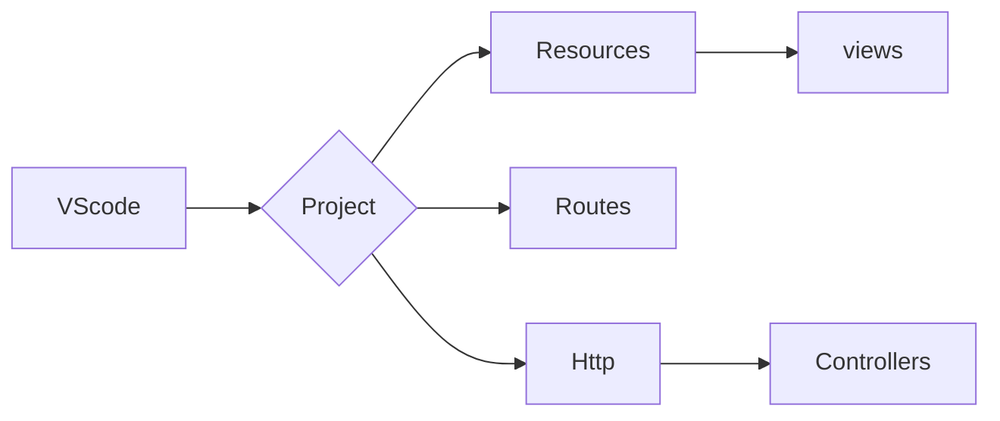

# Sobre o Projeto:
Estudos utilizando o PHP + LARAVEL

- PHP
- Laravel


### LARAVEL

```
1º - composer create-project --prefer-dist laravel/laravel blog "5.4.*"
2º - php artisan serve
```


### FLUXOGRAMA/DIAGRAMA




### FONTE:
<ul>
  
  <li>
    <p><b><code>Laravel - Criando um sistema para gestão de grupos de investimento.</code></b></p>
    <p><i>URL: https://github.com/marcossaore/ambiente-dev-docker](https://youtu.be/0Fol4p26Xv0 </i></p>
  </li>
  
  <li>
    <p><b><code>Laravel 5.4.</code></b></p>
    <p><i>URL: https://laravel.com/docs/5.4</p>
  </li>
  
  <li>
    <p><b><code>Laravel 5 - Repositories to abstract the database layer</code></b></p>
    <p><i>URL: https://github.com/andersao/l5-repository</p>
  </li>
  
  
  
</ul>

